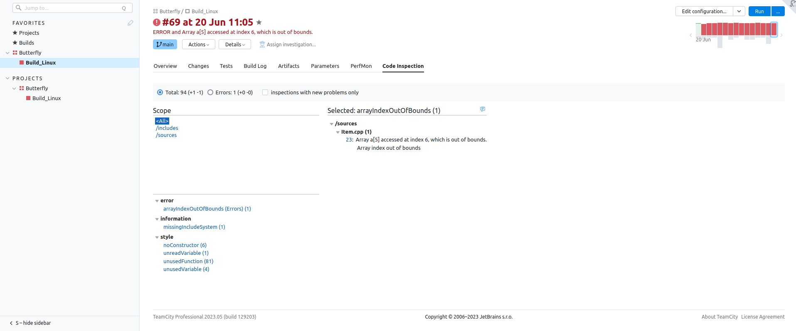
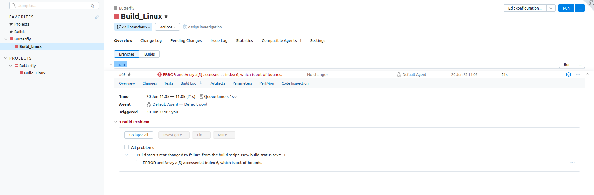

# cppcheck-xml-parser
Cppcheck xml parser for teamcity code inspect tab

Hello, this is a simple xml parser for cppcheck static analyzer,  
to get code inspect tab working in your teamcity project.

Usage example:  
* cppcheck --xml --output-file=inspect.xml main.cpp
* python3 inspection_parser.py inspect.xml

This will produce service messages that teamcity recognizes and fill out your code inspect tab.  
If there was an error the script will change your build status to failed with the reason it failed.  
  
The second argument parser takes is base path of your project.  
If not given it will just use the current working directory as base path.

You can move this script into system paths so you can run it from anywhere to make it more accessible to use.  
ex. on Linux:  
* add #!/usr/bin/env to the top of this script file
* remove .py extension name
* place it in /usr/bin/env
  
You are free to modify file as you like and do whatever you want with it.  
Contributting to the repo is welcome

Result:  
  

